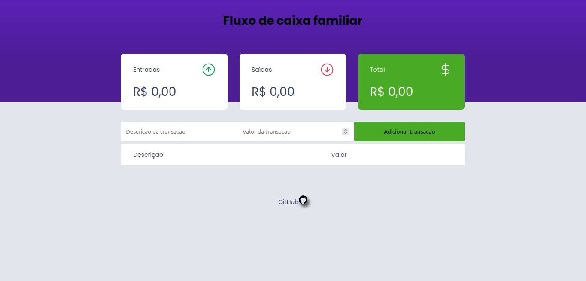

# Workshops - Exercícios Programas: Skyrats

Criei este repositório como uma forma de demonstrar publicamente alguns dos aprendizados desenvolvidos durante o tempo que fui membro dessa equipe incrível chamada [Skyrats](SkyRats.github.io)

## Roadmap 

1. Ubuntando o PC
2. Intro a Git e Linux 
3. C++ e Python
4. Desenvolvendo site
5. Programação Orientada a Objeto em C++ e Python 
6. ROS
7. Blender
8. OpenCV
9. Gazebo

## Exercício Programa (EP) - Workshop de introdução à Programação

### Introdução

Neste workshop fomos introduzidos aos principais características da sintaxe das linguagens de programação Python e C++. E para aplicar os conceitos passados durante as aulas foi proposto o desenvolvimento de uma versão simplificada de uma estação de controle nas linguagens aprendidas.

**Desafio**: Criar uma versão da solução desse exercício aplcando os conceitos de POO (Programação Orientada a Objeto)

### Funcionamento

Nosso drone só poderá se mover em dois eixos, altura e posição horizontal.
O código deverá iniciar pedindo:
- O nome do drone (como uma string)
- A posição de início do drone (como um float)

O código deve ter uma interface em que o usuário tem 5 opções de escolha:
1. Armar o drone
2. Decolar o drone
3. Mudar a posição do drone
4. Pousar o drone
5. Sair da interface
Essa interface deverá aparecer para o usuário até que ele escolha a opção número 5.

#### Conceitos aprendidos

Em resumo, foi desafiador realizar esse projeto em C++ apesar de estar familiarizado com a linguagem C e muito interessante conhecer um linguagem totalmente diferente do que eu estava acostumado até então. 
Além disso, estudar por conta própria um novo paradigma de programação e aplicar em ambas as linguagem a um desafio anteriormente resolvido por meio do paradigma imperativo me permitiu compreender as bases desse novo mundo - _Orientado a Objetos_ - e perceber mais claramente as diferenças entre Python e C++, haja visto que aquela se mostrou muito deficiente em termos de recursos para aplicar de forma mais consistente as especificações exigidas pelo escopo do projeto.

## Exercício Programa (EP) - Desenvolvimento de Site

### Introdução

Nesse workshop fomos intruduzidos aos principais conceitos do desenvolvimento front-end utilizando HTML-CSS-Javascript, e numa forma de fixar os conteúdos aprendidos foi proposta a criação de um site. Dessa forma, escolhi desenvolver uma aplicação simples de registro financeiro pessoal.

**Desafio**: 
